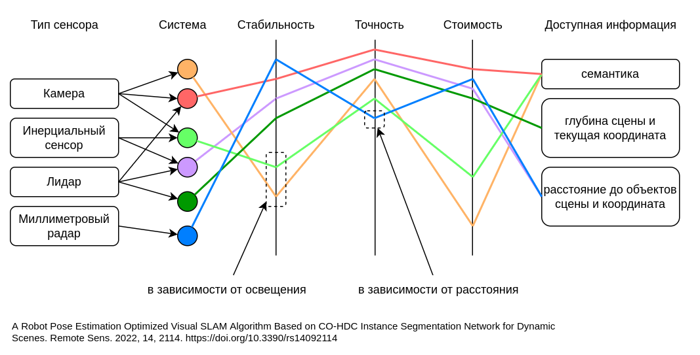
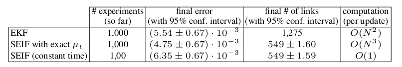
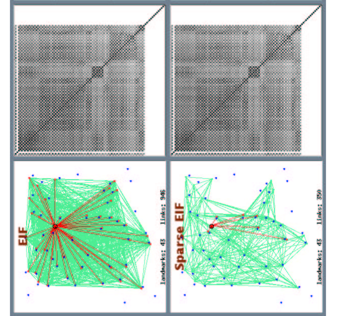

# Ключевые метрики

## Качественное сравнение применения комбинации нескольких датчиков

Различные датчики влияют на вышеуказанные ошибки и соответствие. В настоящее время основными датчиками, используемыми в SLAM, являются камеры, лидары, радары миллиметрового диапазона (mmWave) и комбинация различных датчиков [8–10].
Примеры развития визуального SLAM в последние годы включают применение сети эхо-состояний (ESN) к последовательности модельных изображений [11, 12], объединение нейронной сети с визуальным SLAM [13], CPL-SLAM [14], использование компактного второго статистика порядка [15], комбинация точек и линий для извлечения признаков [16] и другие.
Следует отметить, что основной целью вышеуказанных методов является повышение надежности и точности сопоставления точек признаков визуального SLAM. Lidar SLAM давно разрабатывается и в настоящее время имеет широкое применение. В статье [17] представлен алгоритм SLAM на основе двумерного лидара, который сочетается с алгоритмом новой схемы кодирования структурных единиц (SEUS), в то время как SLAM с двумерным лидарным графом, предложенный в статье [18], основан на трехмерных функциях «направленной конечной точки». лучше выполнять картографические и исследовательские задачи роботов. Взаимодействие нескольких роботов также может повысить точность и эффективность лидарного SLAM [19–22].
Благодаря преимуществам mmWave в спектре и характеристиках распространения [23], применение mmWave в технологии SLAM стало новой тенденцией последних лет [24], и может быть достигнут субсантиметровый SLAM [25]. Например, в статье [26] предложен алгоритм максимального правдоподобия (ML), который может обеспечить точный SLAM в сложном случае множественных входов и одного выхода (MISO).
Комбинация нескольких датчиков может компенсировать недостатки одного датчика и обеспечить более совершенное восприятие [27]. Например, в статье [28 – 30] датчик технического зрения и IMU объединены.
В документе [28] предлагаются гибридные системы внутренней локализации с использованием датчика IMU и камеры смартфона, а также используется алгоритм UcoSLAM [31]. Кроме того, слияние основных датчиков также включает лидар и зрение [32,33], лидар и IMU [19,34] и т. д.

Для того, чтобы показать преимущества и недостатки вышеупомянутых различных датчиков
более четко, мы резюмировали их по четырем аспектам: надежность, точность, стоимость и
предоставленная информация, как показано в таблице 1.

<!-- 
Different sensors affect the above errors and matching. At present, the main sensors used in SLAM include cameras, lidars, millimeter wave (mmWave) radar and the fusion of various sensors [ 8 –10]. 
Examples of visual SLAM development in recent years include applying an echo state network (ESN) to a model image sequence [11 ,12 ], combining a neural network with visual SLAM [ 13 ], CPL-SLAM [14], using compact second-order statistics [15 ], a combination of points and lines to extract features [ 16 ], and others. 
It should be noted that the main purpose of the above methods is to improve the robustness and accuracy of feature point matching of visual SLAM. Lidar SLAM has been developing for a long time and now has widespread application. Paper [17 ] presents a 2D lidar- based SLAM algorithm, which is combined with a new structural unit encoding scheme (SEUS) algorithm, while the 2D lidar graph SLAM proposed in paper [18 ] is based on 3D “directional endpoint” features, performing better in robot mapping and exploration tasks. The cooperation of multiple robots can also improve the accuracy and efficiency of lidar SLAM [ 19– 22]. 
Due to the advantages of mmWave in the spectrum and propagation characteristics [23 ], the application of mmWave in SLAM technology has become a new trend in recent years [ 24 ], and sub-centimeter SLAM can be achieved [25 ]. For instance, paper [ 26 ] proposed a maximum likelihood (ML) algorithm, which can achieve accurate SLAM in the challenging case of multiple-input single-output (MISO). 
Multi-sensor fusion can make up for the defects of single sensor and have more perfect perception [27]. For example, in the paper [ 28 – 30], the vision sensor and IMU are fused. 
Paper [ 28 ] proposes hybrid indoor localization systems using an IMU sensor and a smartphone camera, and adopts a UcoSLAM algorithm [ 31 ]. In addition, mainstream sensor fusion also includes lidar and vision [32,33], lidar and IMU [19,34], etc.

In order to show the advantages and disadvantages of the above different sensors
more clearly, we have summarized them in four aspects: robustness, accuracy, cost and
information provided, as shown in Table 1. -->

| Sensor |Robustness |Accuracy |Cost |Information Provided
|---|---|---|---|---|
| visual        |susceptible to light | high | cheap | rich semantic information
| lidar         |high       | higher |expensive | only depth and position
| mmWave        |higher     | high in long distance, low in short distance | expensive | only distance and position
| visual + IMU  |susceptible to light | high | normal | rich semantic information
| lidar + IMU   |high       | higher | expensive | only distance and position
| visual + lidar |high      | higher | more expensive | rich semantic information

It can be seen that visual sensors are the cheapest sensors [ 7 ] and can provide rich, high-
dimensional semantic information [35 ], which can complete more intelligent tasks, although
they have low robustness under current technological means. However, the traditional
visual SLAM assumes a static environment. For an environment with dynamic objects, its
accuracy decreases [36–38]. With the development of deep learning in computer vision and the
increasing maturity of instance segmentation technology, the combination of visual SLAM and
deep learning can identify and extract moving objects in the environment [39–41]. Through
instance segmentation, dynamic objects in the environment are removed, and only static
feature points are retained, which can significantly improve the accuracy of visual SLAM,
such as You Only Look At CoefficienTs (YOLACT) [ 42]. Therefore, visual SLAM is no
longer limited to static scenes. More and more researchers have begun to research the use
of visual SLAM in dynamic scenes [ 43 ]. At present, the main SLAM algorithms based
on dynamic feature point segmentation include DS-SLAM [44 ,45 ], DynaSLAM [46, 47],
LSD-SLAM + Deeplabv2 [48], SOF-SALM [49 ], ElasticFusion [50 ], RS-SLAM [51 ], DOT +

ORB-SLAM2 [ 52], etc. We evaluate the existing algorithms from five aspects: frontend,
mapping, whether the segmentation network is independent, the accuracy of contour
segmentation and the efficiency in dynamic environment. Among them, the frontend
influences feature selection, extraction, matching and local map construction. Mapping
affects the details of map construction, but the more details, the more calculation. An
independent segmentation network reduces calculation time. The segmentation accuracy
of contour will affect the elimination of dynamic feature points. We refer to papers [ 53 ,54 ]
for the accuracy of contour segmentation and the efficiency in a dynamic environment. The
details are shown in Table 2.

### Composition of the Visual Map

<!-- from gonzalo's paper -->

Once SLAM has provided the poses for the cameras, we are ready to define
a map. Contrary to other approaches, which use the aggregated set of
keypoints generated as a result of SLAM, we will keep a subset of all the
frames with its corresponding 3D pose.
More formally, we define the map M as a set of pairs, composed of 3D
poses Ti ∈ SE(3) and Keyframes KFi ∈ R4×H×W , which are raw RGBD
images from the Azure Kinect camera.

Note that the size of the map is smaller than the result of the SLAM
algorithm, in other words H′ < H, since the selection of keyframes requires
to decimate the since of it for further purposes. At this current state, we use
a simple heuristic to select the keyframe of the map, we decimate uniformly,
and since the speed and the coverage of the space was also regular, this can
provide good results.

### Сложность построоения карты и локализации

<!-- from: Optimal local map size for EKF-based SLAM
file:///home/user/Downloads/iros_2006.pdf -->

Проблема построения карты актуальна поскольку различные алгоритмы картирования могут обладать квадратичной и более сложностью при построении карты. Соответственно необходима процедура для работы с большими картами.

Процедура построения карты включает в себя определение замыкания, определение связей с уже построенной картой. 
<!-- Эти операции имеют линейную сложность от количества элементов в карте, соответственно вычисление карты при ее построении будет иметь квадратичную сложность в лучшем случае. -->

Поскольку такого рода операции могут иметь ограничение на выполнение на мобильном устройстве для больших сцен - мы на раннем этапе рассматриваем возможные сценарии масштабирования системы.

Проблема одновременной локализации и навигации
(SLAM) заключается в размещении объекта (транспортного средства) в неизвестной локации без предварительной информации о его местонахождении. Следовательно алгоритмы должны одновременно определять и собственное местоположение объекта, и строить карту окружениия. SLAM в значительной степени считается решенным для небольших локаций (комната, коридор, этаж).
Обе наиболее популярные категории классических методов локализации и навигации успешно решают эту задачу:
методы основанные на расширенном фильтре Калмана (EKF-
SLAM)
и методы на основе выбора ключевых кадров
могут надежно и эффективно справляться со средами ограниченного размера.

Сокращение вычислительной стоимости выполнения SLAM в больших средах - реальная задача которая еще не полностью однозначно решена.

<!-- В последние годы интерес был сосредоточен на сокращении предполагаемая стоимость выполнения SLAM в больших средах. -->

Методы EKF-SLAM имеют первое важное ограничение:
вычислительные затраты на обновление карты на каждом шаге составляют порядка O(n2), где n — количество объектов на карте.
В методах, основанных на выборе ключевых кадров, количество необходимых расчетов растет экспоненциально с неопределенностью положения объекта. 

В любом случае, возможность мобильных устройств поддерживать и корректно работать с картами большого размера сомнительна хотя бы с точки зрения возможности одновременно скачать весь файл карты.

Для поддержания динамики работы алгоритма локализации и навигации карту требуется разбить на набор отдельных элементов.

Генерация карты предполагает сшивание целой карты из отдельных кусков сцены. Работа с готовой картой предполагает запрос и получение необходимого участка карты локального окружения.

<!-- 
В случае EKF основная вычислительная
связанных с этим затрат является обновление матрицы конвариантности n × n.
Разреженный расширенный информационный фильтр (SEIF) [5] обращается к
проблема сложности EKF, заметив, что информация
матрица, обратная матрице ковариации, вычисленной
EKF, является приблизительно разреженным, и, таким образом, может быть выполнено O(n) обновлений.
достигается путем работы над разреженной аппроксимацией
информационная матрица. Однако было отмечено [6], что
оценка на основе EKF имеет второе важное ограничение:
он быстро становится несогласованным в больших средах из-за
нелинейности, присущие большинству задач SLAM. Таким образом, SEIF
оценки будут страдать от тех же проблем с несогласованностью
ЭКФ. -->
Алгоритм для получения локальной карты и общая архитектура метода
была предложена в [] для преодоления вычислительной сложности метода EKF. 

В случае с использованием нейронных методов для локализации:
- известна примерная текущая координата, следовательно экспоненциальная сложность метода SLAM работающего на основе ключевых кадров находится примерно в линейной области
<!-- - EKF методы не используются -->
- Методы нейронной локализации имеют фиксированное время исполнения запроса, но общая точность модели пропорционально размеру модели - соответственно утверждение справедливо только для карт конечного размера
- Размеры файла карты всве равно пропорционально растут с размером карты и ее детализацией, в зависимости от ограничений платформы меняется максимальный для работы размер карты

Предложенный в [] метод, уменьшает вычислительные затраты и улучшает согласованность EKF алгоритма. 

<!-- Локальная карта -->

<!-- The problem of Simultaneous Localization and Mapping
(SLAM) consists in placing a vehicle in an unknown environ-
ment with no prior information on its location, and have it
concurrently determine both its location and the environment
structure. SLAM is largely considered solved in small envi-
ronments. Both Extended Kalman Filter based methods (EKF-
SLAM) [1], [2], [3] and sampling based methods [4], [5] can
robustly and efficiently deal with environments of limited size.
In recent years, interest has focused on reducing the com-
putational cost of performing SLAM in large environments.
EKF-SLAM techniques have a first important limitation: the
computational cost of updating the map at each step is of
order O(n2), where n is the number of features in the map.
In sampling based methods, the number of required sam-
ples grows exponentially with the uncertainty of the vehicle
location. In the case of the EKF, the major computational
costs involved is updating the n × n convariance matrix. The
Sparse Extended Information Filter (SEIF) [5] addresses the
complexity issue of the EKF by observing that the information
matrix, the inverse of the covariance matrix computed by the
EKF, is approximately sparse and thus O(n) updates can be
achieved by working on a sparsified approximation of the
information matrix. However, it has been pointed out [6] that
the EKF-based estimation has a second important limitation:
it quickly becomes inconsistent in large environments due to
nonlinearities inherent to most SLAM problems. Thus SEIFs
estimations will suffer from the same inconsistency problems
of EKF.
In this paper we study an alternative technique that reduces
the computational cost and improves consistency: Local Map -->

<!-- Local Map Sequencing [14]. Instead of building one global map, this technique builds a set of independent local maps of limited size. Local maps are then joined together into a global map that should be equivalent to the map obtained by the standard EKF-SLAM approach, except for linearization errors. How to decide the size of each local map remains unanswered in [14].  -->

Последовательное сшивание локальных карт: вместо создания одной глобальной карты, метод создает набор независимых локальных карт ограниченного размера. Затем локальные карты объединяются в одну глобальную карту, которая должна быть эквивалентна карте, полученной с помощью стандартного подхода (EKF-SLAM), за исключением ошибок линеаризации. Оптимальная процедура как определить размер каждой локальной карты, не указана.
В статье предлагается делить карты на отдельные файлы при достижении набора видимых ключевых точек в карте.
При разделении карты на 25 отдельных файлов общее время построения карты уменьшилось в 50 раз.

<!-- 
Related decompositions have been proposed in [7], [8], [9], [10]. There are also a number of methods that use local maps for SLAM [11], [12], [13] with alternative joining steps. In none of these methods is this question answered. We believe that these methods can also benefit in terms of computation cost as well as map consistency from the analysis proposed here.

What happens if we divide the full map in N smaller local
maps and then join them together? In order to try to answer this question, we divided the environment in 25 smaller maps, and so the same dataset was processed to obtain independent local maps at fixed trajectory intervals of about 10 m. The local maps were joined and fused obtaining the global map shown in figure 1, bottom. In this case the loop was correctly detected by data association and the map obtained seems to be consistent. Furthermore, the computational time was about 50 times smaller than the standard EKF approach. Thus, there is a strong reduction in computational cost and increase in
consistency of the resulting map. -->

This experiment raises the following questions: given a certain environment size and sensor characteristics 

1. is there a computationally optimal local map size, such that the total computational cost is minimal? 
1. is there a consistency optimal local map size, such that the consistency of the final map is maximal? 
1. do these optimals coincide? 

Для операций с большими картами существуют более подходящие методы чем EKF-SLAM, но существующие оптимизации этого метода могут быть использованы при проектировании системы локализации и навигации.

Например предложенная в статье [SLAM Updates Require Constant Time. Sebastian Thrun1 , Daphne Koller2 , Zoubin Ghahmarani3 , and Hugh Durrant-Whyte4]
техника иерархического решения задачи одновременной локализации и навигации.

Решение позволяет получить разреженную матрицу связей и соответсвенно снизить сложность обновления карты с квадратичной до практически линейной без значительно  уменьшения точности.

<!-- Если рассматривать эту технику в более общем виде, то ее можно использовать для  -->

<!-- В этой статье описывается масштабируемый алгоритм для одновременного отображения и локального
проблемы с SLAM. SLAM – это задача определения местоположения экологических -->
<!-- функции с бродячим роботом. 
Многие из популярных сегодня методик основаны на расширенном методе Калмана. -->
<!-- фильтры (EKF), которые требуют времени обновления, квадратичного по количеству объектов на карте.  -->

Статья развивает понятие разреженных расширенных информационных фильтров (SEIF) как метод для
решение проблемы SLAM. SEIF используют структуру, присущую проблеме SLAM, представляя
карты через локальные, похожие на сети графы связей объектов. 

Таким образом, обновления могут выполняться в
постоянное время, независимо от количества объектов на карте. 
Результаты экспериментов показывают высокую точность
полученных SEIF карт по сравнению с вычислительно более громоздким решением EKF.

<!-- В данной статье представлены несколько оригинальных результаты SEIF с постоянным временем и обеспечивает результаты моделирования, которые показывают высокую точность
полученных карт по сравнению с вычислительно более громоздким решением EKF. -->

Выше представлен пример сравнения EKF с фильтром SEIF.
Этот результат был получен с использованием разреженной информационной матрицы.
 <!-- с θ x = 6, θx = 10, и реализация координатного спуска с постоянным временем, которая обновляет K =
10 случайных ориентировочных оценок в дополнение к ориентировочным оценкам, связанным с
робот в любое время.  -->

Ключевым наблюдением является очевидное сходство между EKF
и результат SEIF. Обе оценки практически неразличимы, несмотря на то, что EKF используют квадратичное время обновления, тогда как SEIF требует только постоянного времени.

Вторая строчка - результаты SEIF, в котором вычисляется точная оценка состояния текущего состояния µt. Такое решение требует вычисления инверсной матрицы на каждом этапе вычисления (поэтому решение не работает за постоянное время $O(1)-> O(n^3)$). 

Это позволило понять и отделить ошибку, вносимую шагом восстановления амортизированного среднего, от ошибки,
полученной за счет преобразования матрицы к разреженной. 
Результаты в таблице представлены для N = 50 меток- ориентиров, 500 циклов расчета карты, в итоге видно соответствие результатов для всех трех подходов.

Работа алгоритма спарсификации данных

Поскольку алгоритм спарсификации данных карты по факту реализует умную фильтрацию данных карты, если в системе будет по ее построению меньше связей - вычислительная сложность метода будет соответственно меньше.

Для однократного вычисления метода нейросетовой локализации требуется посчитать значения весов нейросети для одного изображения, найти в файле карты ближайшее значение вектора для ранее кодированных и маркированных изображений.

Таким образом метод имеет практически константную сложность выполнения: 
- время кодирования изображения константно
- время поиска по хэшированному файлу карты константно

<!-- This result is typical and was obtained using a sparse information matrix with θ x = 6,
θx = 10, and a constant time implementation of coordinate descent that updates K =
10 random landmark estimates in addition to the landmark estimates connected to the
robot at any given time. The key observation is the apparent similarity between the EKF
and the SEIF result. Both estimates are almost indistinguishable, despite the fact that
EKFs use quadratic update time whereas SEIF require only constant time.
We also performed systematic comparisons of three algorithms: EKFs, SEIFs, and
a variant of SEIFs in which the exact state estimate µt is available. The latter was im-
plemented using matrix inversion (hence does not run in constant time). It allowed us to
tease apart the error introduced by the amortized mean recovery step, from the error in-
duced through sparsification. The following table depicts results for N = 50 landmarks,
after 500 update cycles, at which point all three approaches are near convergence.
 -->

<!-- 
In this paper we try to answer these questions. 
In section II we describe the local map sequencing problem for a given environment size and feature density, sensor characteristics and size of local map. 

In section III we detail its related com- putational cost and derive the optimal solution. We validate this solution using a simulated experiment. 
In section IV, we study the obtained solution with respect to map consistency and error. Monte Carlo simulations are used to show that the solution of minimal computational cost is also the one that provides the map of maximal consistency. Finally, in section V we draw the main conclusions of this work and outline future directions of work. -->