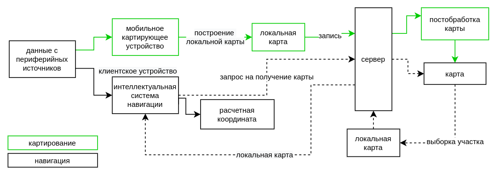

## Масштабирование системы

Для определения стратегии масштабирование системы необходимо понимать декомпозицию процессов генерации, обработки и передачи данных в системе.

Суммарная вычислительная сложность системы складывается из размера карты, сложности алгоритмов и одновременного количества картирующих агентов и пользователей.

Для создания масштабируемой системы часть нагрузки на систему необходимо перенести на мобильное устройство локализации и картирования: выбор ключевых кадров, построение локальной карты, предобработка изображений и т.д.

Оценим количество данных в системе и основные элементы и компоненты где происходят преобразования данных.

Попытаемся оценить как формат данных будет влиять на производительность системы. 
Оценим другие возможные реализации отдельных компонентов системы. Приведем техническое обоснование выбора конкретных решений при дизайне системы. 
Опишем открытый для решения набор параметров: какие возможные методы и процедуры могут быть применены в уже готовой системе. Какие параметры для настройки и масштабирования системы остаются.

## intro

<!-- телефон - slam - камера + алгоритмы -->

какое количетсво данных генерируется с лидара/камеры при одной записи

## dataflow model

telemetry-computational_node-server-map_storage

telemetry-client-server
telemetry-client-map

dataflow model

количество обработки данных на платформе, на сервере
обновление карты - как регулярно, какая процедура

сколько всего файлов карты хранится, сколько может скачать пользователь

потоковая передача карты на смартфон