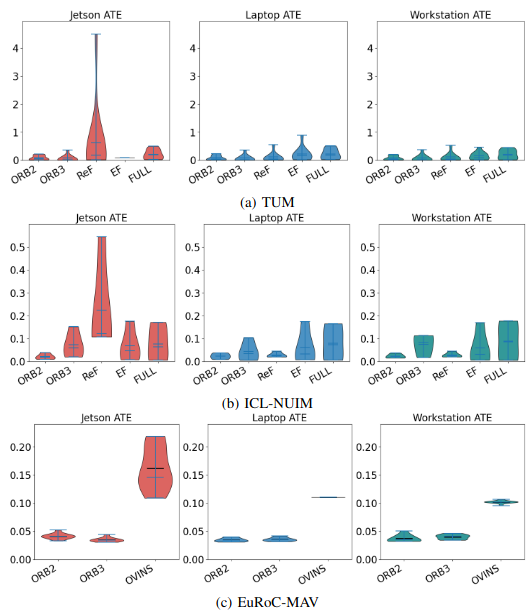
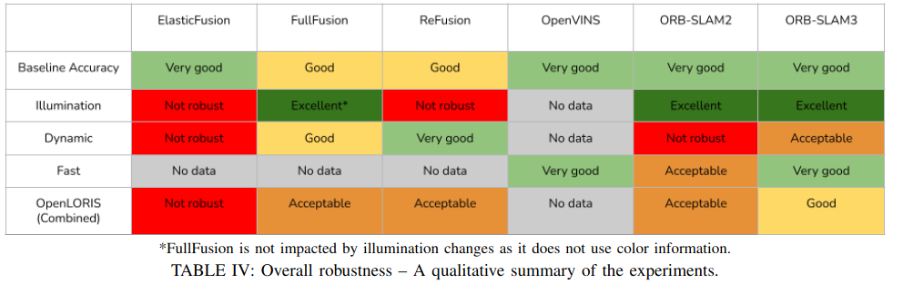

reading from https://arxiv.org/pdf/2109.13160.pdf
<!--  -->

Сравнение производительности алгоритмов локализации и навигации на разных датасетах для разного класса устройств

На рисунке выше показаны значения оценки базовой точности различиных методов. Используются данные простых последовательностей из разных датасетов - нет сложных условий освещения или им подобных.

Как видим на рисунке выше для мобильной платформы Jetson Nano (левая колонка), значения ошибок для определенных алгоритмов и данных выше чем в аналогичных колонках.

Для платформы с меньшей производительностью чем стационарный компьютер или сервер заметно снижение качетсва локализации для некоторых методов: ReF, Ovins.

ReFusion [2] is a dense RGB-D 3D reconstruction method
which exploits residuals obtained after the registration of
input data with the reconstructed model to identify and filter
out dynamic elements in the scene.

<!-- Для метода с плотной картой возможно что не хватает оперативной памяти устройства для полноценных расчетов локализации. -->

OpenVINS [7] is a stereo visual-inertial SLAM system
which uses an Extended Kalman Filter to fuse visual odom-
etry with inertial measurements.

<!-- Решение визуальной одометрии может быть нестабильным если уменьшить частоту кадров при решении. -->

Baseline performance – We evaluate the trajectory estima-
tion accuracy of each SLAM system on selected sequences
of widely-adopted datasets where no significant perturbations
are present. The RGB-D based SLAM systems are evaluated
with 12 sequences from the TUM freiburg1 and freiburg2
datasets [6] and the 4 sequences of the ICL-NUIM living
room dataset [5]. Our results (Figures 3-a and 3-b) are consis-
tent with the existing literature. ORB-SLAM2, ORB-SLAM3
and ElasticFusion are accurate within 1% on all sequences
and no individual runs exceeded 3% error. FullFusion and
ReFusion maintained their ATE below 3% on most runs,
but scored worse than the aforementioned systems (with
few exceptions). ORB-SLAM3 is the most accurate in this
baseline setting, with ORB-SLAM2 closely after.
SLAM systems supporting stereo and visual-inertial
SLAM are evaluated on the 7 easy and medium sequences
of the EuRoC-MAV dataset. Figure 3-c shows all 3 SLAM
systems have similar accuracies and performed within a
0.5% error margin.

motion, non-uniform illumination, and dynamic scenes. The
experiments have covered 6 datasets across 3 computing
platforms, in both episodic and long-term operation settings.
Thus, this evaluation is the most comprehensive study of
the robustness of SLAM systems to date. By including the
Nvidia Jetson Xavier platform, we also consider constraints
associated with deployments on systems embedded within
robots.
Overall, we have found that ORB-SLAM3 provides the
best balance between baseline accuracy, illumination and
fast changes, support for dynamic environments and Lifelong
scenarios, although its FPS is below 15 (5 FPS on Jetson).
Considering the three dense SLAM systems, FullFusion
provides the best balance, but reaches 30 FPS only on the
laptop and workstation (Jetson 25 FPS). ElasticFusion offers
between 40-50 FPS processing on the three platforms, but
its robustness falls below the other SLAM systems.
Finally, the sparse SLAM systems have proved more
robust than the dense ones, probably because there are fewer
data points which can negatively impact pose estimation.
We consider that combining sparse tracking with dense 3D
reconstruction will help systems build expressive represen-
tations while maintaining high robustness.