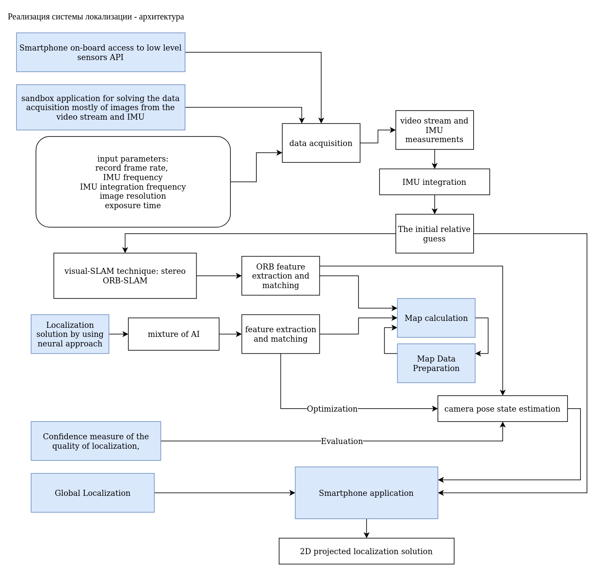
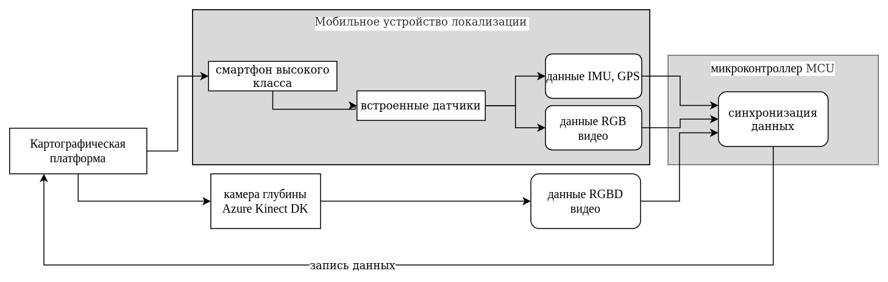
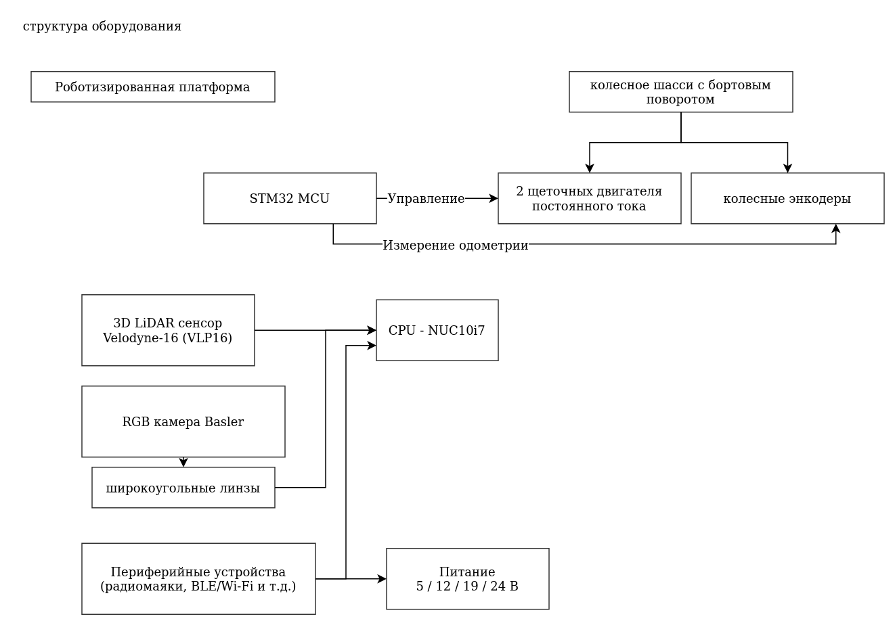
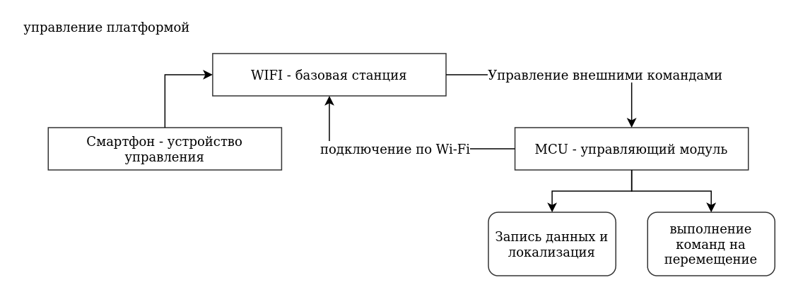
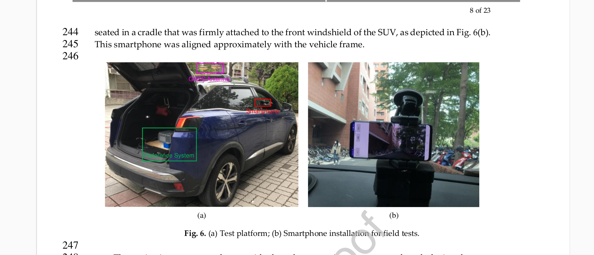

# обоснование технических решений на создание аппаратной части аппаратно-программного комплекса средств платформы для системы интеллектуальной навигации с использованием технологии искусственного интеллекта
<!-- // Разработка и производство аппаратно-программного комплекса средств программно-аппаратной платформы для системы интеллектуальной навигации с использованием технологии искусственного интеллекта -->

## Описание проекта

Описание
- формирование требований к решению
    - выбираем предполагаемый сценарий использования
    - формируем качественные требования к платформе в использовании - скорость, частоту обновления кадров, …​
    - формируем качественные требования архитектурные особенности построения системы
    - формируем количественные требования - производительность отдельных устройств и алгоритмов
- технологическое обоснование решения
    - ссылка на реальные системы - как они работают
    - формируем набор метрик для оценки систем
    - сравнение с близкими решениями (если есть данные)
    - качественная оценка работы системы на каждом этапе
    - количественная оценка программного и аппаратного обеспечения - производительность, надежность системы, точность решения, частота решения
- решение - описание проекта
    - стадии, все прототипы объектов картирования и навигации
    - архитектура системы
    - демонстрация работы системы при выполнении отдельных этапов проекта - сценарии тестирования, ожидаемые результаты

## Концепция использования -  сценарии использования

- concept of operation
- prototype: for system to start working
- requirements to system: meet minimum viable requirements
- look on hardware: map existing solutions
- possible HW solutions: mobile robot, car

## формирование требований к решению

- выбираем предполагаемый сценарий использования
- формируем качественные требования к платформе в использовании - скорость, частоту обновления кадров, …​
- формируем качественные требования архитектурные особенности построения системы
- формируем количественные требования - производительность отдельных устройств и алгоритмов

### Описание прототипа - как и что тестируем

- текущий робот - что работает, что тестируется: построение карты, semantic mapping, matching the location какие алгоритмы появятся дальше,
- look to next prototype stage
- after mapping is good - how to start working with car system
- как мы определяем / выбираем конфигурацию оборудования

### FOMs - значимые метрики продукта / системы навигации

- map all important metrics (accuracy, precision, robustness)
- рассматриваем системы автономного вождения: WEYMO, tesla, yandex…​ - как используются (?) лидары - видимость, надежность…​ - поискать статьи

### локализация мобильного робота в условиях улица / здание

- построение карты
- стабильная работа системы в динамическом окружении
- отладка и настройка инфраструктуры

### локализация автомобиля в городских условиях

исходные данные:
- построение карты с автомобиля в ручном режиме
- благоприятные условия для построения карты
- используются разные конфигурации оборудования, выбирается наиболее практичная и надежная конфигурация
- демонстрация основного сценария работы системы в нормальных условиях - определить условия для 90% нормального времени функционирования системы

## roadmap - стратегия и путь разработки

- how to get from prototype to final product, what are the milestones
- сценарий разработки
- описать пространство технических решений - какие конфигурации тестируем, порядок работы, …​.

#### handheld prototype - FOMS

.testing and configuring for different system parameters
* frame rate at which to acquire data
* the frequency of the IMU’s and its integration
* the image resolution
* exposure time

The testing conditions for localization - параметры для тестирования системы навигации -

* движение со смартфоном в руках
* низкая динамика движения - при соответствующем времени экспозиции и частоте сканирования - гарантия качественной съемки
* выбор среды с наличием объектов для привязки - текстуры, предметы
* отсутствие визуально шумного окружения - большого количества людей / движузихся объектов в зоне съемки
 

// will be a handheld smartphone under human-like walking, orientation limited to looking-forward views, with low dynamic, stable grip of the device (this is equivalent to low blurring) and pointing to textured regions when possible (textureless areas such as a narrow view to a flat wall would of course provide a poor solution).

параметры системы  реальные
оценочные параметры

## выбор технических решений

- ссылка на реальные системы - как они работают
- формируем набор метрик для оценки систем
- сравнение с близкими решениями (если есть данные)
- качественная оценка работы системы на каждом этапе
- количественная оценка программного и аппаратного обеспечения - производительность, надежность системы, точность решения, частота решения

описать (стратегию) сценарий выбора

- differential GPS
- car odometry
- mobile robot for manual testing
- open datasets
- broad range of experiments

## Решение 

- стадии, все прототипы объектов картирования и навигации
- архитектура системы
- демонстрация работы системы при выполнении отдельных этапов проекта - сценарии тестирования, ожидаемые результаты

Решение, которое мы предполагаем предоставить для системы локализации, включает следующие компоненты:

- аппаратная часть
    - Система смартфон-сервер - система локализации
    - Носимая записывающая платформа, объединяющая смартфон и камеру глубины Azure kinect
    - Колесная платформа для картографирования и локализации - телеуправляемый колесный робот & набор датчиков
    - Система серверов на открытом воздухе - портативная серверная платформа
- Программная часть
    - Нейросетевой фреймворк
    - Сервер-смартфон - система глобальной релокализации
    - Сервер
- Сценарии тестирования системы
    - демонстрация - автономное картирование с помощью работа и телеуправление
    - демонстрация - препроцессинг данных карты - расчет карты и семантическая фильтрация
    - сбор данных с использованием (Носимая записывающая платформа)
    - получение совместной карты
    - тестирование локализации по построенной карте (Система смартфон-сервер)

Поскольку рассматривается сценарий сбора данных из разных источников и для простоты тестирования - разрабатывается несколько типов прототипов: носимое, мобильная платформа - робот и решение которое можно установить в автомобиль.

В дальнейшем планируется использовать два типа устройств: смартфон и автомобиль - как наиболее востребованные решения.

Отрабатывается сценарий построения карты и общая производительность системы.

Разработанная стратегия определяет возможность дальнейшего  масштабирования решения и общее время разработки проекта.

Итеративный подход к разработке позволяет на каждом этапе разработки обеспечить производительность работы всех вариантов решений.

Поскольку для автомобиля требуется большая карта и соответственно доработанная оптимизация всех систем навигации - решено начать с малого окружения и доработать систему при низких скоростях движения и гарантированном качестве съемки. Для этого используются носимое устройство картирования и телеуправляемая мобильная платформа - робот.

Карта которая строится по итогам записи с разных устройств в общем смысле не является идентичной. В случае автомобиля может присутствовать другой а=набор датчиков которые работают на других скоростях и физических принципах.

Для того чтобы гарантировать работу разных устройств с одной и той же картой принимается решение кодировать карту в универсальное воксельное представление - параллельно с картой создается файл который явно описывает пространство окружения с определенной дискретизацией. 
Далее любое устройство (смартфон) сканирует окружающую обстановку и преобразовывает ее до аналогичного воксельного представления.
Такой алгоритм является универсальным в отношении работы с картой. 
В то же время алгоритм кодирования измерений до воксельного представления является вычислительно сложным. Поскольку его необходимо запускать на смартфоне в реальном времени или запускать на автомобиле и обеспечить большую частоту дискретизации - 
параллельно могут работать другие нейросетевые алгоритмы с меньшей вычиислительной сложностью которые реализуют ту же задачу.

Общее решение локализации представляет собой набор нейросетевых и классичестких алгоритмов локализации которые определяют координату объекта навигации совместно.

Для автомобиля существует возможность более точного решения с использованием одометрии самого автомобиля. Это решение должно разрабатываться отдельно после демонстрации работы системы в меньшем масштабе.

Далее будет проводиться работы по оптимизации вычислительной сложности на мобильных устройствах (смартфон, автомобиль), модификации карты (размер, детализация), модификации точности решения совместно за счет модификации карты, более точного обучения нейросетевых алгоритмов навигации, выбора и доработки самих алгоритмов навигации.

Отдельно к процессу доработки программной части навигации идет поддержка и доработка аппаратной части.

Аппаратная реализация прототипа должна обеспечить быструю разработку и надежность результатов навигации.

Для жкспериметров с гетерогенными источниками данных рассматриваем универсальный подход к сбору информации. На мобильную платформу может устанавливаться любая конфигурация датчиков которые могут обеспечить качество разработки решения.

В прототипе могут использоваться дополнительное контрольное устройство для получения значений кооординат из внешних источников и валидации собственного решения локализации.

Также на этапе разработки тестируется разные конфигурации датчиков: количество, расположение и технология лидаров, камер и других сенсоров. Все планируемые для экспериментов конфигурации будут описаны ниже в документе.

Спецификации аппаратной реализации платформы и список возможных контрольных устройств будут описаны ниже.

- TBD: Спецификации аппаратной реализации платформы
- TBD: список возможных контрольных устройств

### Предполагаемое решение

Предполагаемое решение, для системы локализации, включает следующие компоненты:

1. Бортовой доступ смартфона к API датчиков низкого уровня и приложение-песочница для решения проблемы сбора данных, в основном изображений из видеопотока и измерений IMU, подготовка к интеграции алгоритма (1.4). Временные метки должны быть из одного и того же центра синхронизации. Требования включают тестирование и настройку для различных параметров, таких как частота кадров, с которой нужно получать данные, частота IMU и их интеграция, разрешение изображения, время экспозиции. 
1. Подготовка картографических данных. С платформы датчиков получите все доступные данные с датчиков: IMU, камера плюс камера глубины. Мы выберем наилучшие конфигурации датчиков и параметров и используем их для получения наилучшего результата при сборе данных для составления карты.
1. Расчет карты. После получения данных, мы рассчитаем решение карты, которое использует визуальную технику SLAM: стерео ORB-SLAM.
1. Решение локализации с помощью нейронного подхода, представляющего собой смесь искусственного интеллекта для извлечения и сопоставления признаков и оптимизации для оценки состояния позы камеры. Начальное относительное предположение для локализации берется из интеграции IMU. Эта реализация будет выполнена на языке pytorch в качестве первой попытки, а затем оптимизирована для мобильных приложений.
    1. Первая итерация, запущенная на сервере на низкой частоте (менее 1 Гц).
    1. Вторая итерация, выполняемая на борту после оптимизации сети до возможностей устройства. Мы будем исследовать компромисс между точностью и вычислительными ресурсами.
    1. Третья итерация, нам нужно быстрое относительное позиционирование относительно медленной локализации, для этого мы будем использовать интеграцию IMU, работающих на более высокой частоте, чем 4.2. Это решение можно начать с решения по качанию от Navigine.
1. Мера доверия к качеству локализации, чтобы подать сигнал на серверную сторону, когда требуется более сложное решение.
1. Приложение для смартфонов, использующее сбор данных и их интеграцию с предоставленным алгоритмом (Navigine) Визуализации будут в 2D, спроецированные из решения 3D локализации.
1. Сервер-смартфон: Если локализация не удается на устройстве (мера доверия, описанная выше), сервер запускает "Глобальную локализацию", используя извлеченные характеристики для распознавания места по последовательности прошлых изображений плюс другие доступные датчики на фоне полномасштабной карты.

### Архитектура системы

<!-- список компонентов, декомпозиция проекта: -->

Архитектура компонентов системы, основные компоненты выделены синим цветом.

Для носимой платформы - показана декомпозиция отдельных компонентов.

### требования и ожидаемые результаты:

- Сборка мобильной платформы со всеми элементами управления, драйверами и бортовыми датчиками: LiDAR, камера, Wi-Fi
- Сбор картографических данных - preprocessing
- Расчет карты - sensor fusion
- Локализация на борту робота - on-device cpu processing (как в задаче смартфон - сервер)
- Передача потока изображений и облака точек на сервер - Анализ возможностей пропускной способности системы
- Глобальная релокализация - разработка компонента глобальной релокализации - с участием сервера
- Визуализация решения по локализации -

архитектура решения
- концепция системы - карта, объекты навигации, общие требования
- сбор данных: сервисы и архитектура
- обработка данных - построение карты, формат данных, использование
- объекты сбора данных - авто, мобильный робот, носимое устройство - реализация, требования
- инфраструктура и прототип - серверная часть, требования, стадии развития системы, сценарий развития
- работа системы - навигация и локализация
- прототип - описание

<!-- Можно сделать на основе вот этого документа, который мы составляли ранее. https://docs.google.com/document/d/11BPG1T_eKkwsSGOMTdyoDfWpJQyCtTfb/edit?usp=sharing&ouid=112537363798909584290&rtpof=true&sd=true
архитектура, разбор по модулям
описание каждого модуля -->

### Этапы разработки решения

описать этапы, deliverables, timeline, metrics vs timeline

1. объект сбора данных - носимая платформа
- сбор данных
- построение карты
- свойства карты

1. объект сбора данных - мобильная платформа робот
- отладка алгоритмов
- модификация карты
- построение инфраструктуры
- выбор алгоритмов
- масштабирование - для использования большой карты

1. объект сбора данных - автомобиль
- доработка алгоритма локализации
- эксперименты в сложном окружении
<!-- - динамическая карта ??? - работа в меняющемся ок -->

пример использования мобильного устройства в качестве источника данных системы навигации для автомобиля:

## Технологическое обоснование выбранного решения

<!-- ### обоснование технических решений -->

- какие системы ИИ мы используем, какие возможно будем использовать
- мы планируем использовать оборудование …​
- структурная схема
- какие риски мы рассматриваем
- прототип - какие тех решения используем
- запас по выч мощности - достаточность для выполнение функции
- надежность - тестирование оборудования и систем
- импортозамещение - есть необходимые устройства, есть вся необходимая периферия
- соответствие требованиям проекта
- Нужно написать, описать, обосновать аппаратную составляющую и архитектуру решения (в том числе общий pipeline обработки данных)

