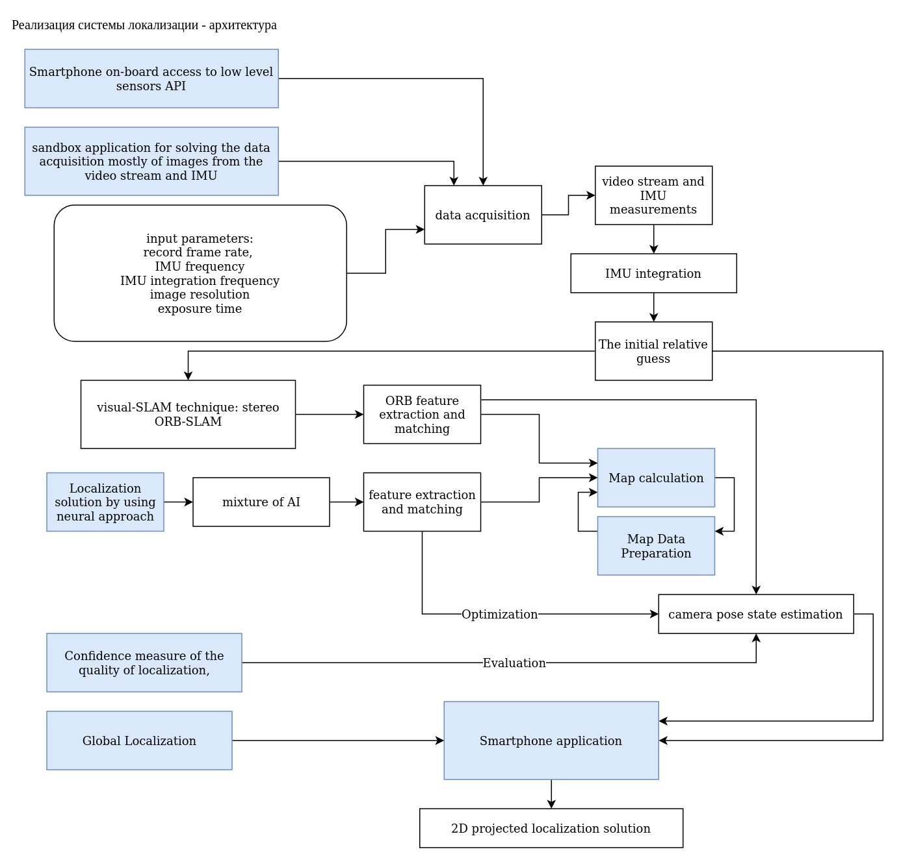

техническое задание на разработку платформы

## требования к решению

### цель

создание частей аппаратно программных продуктов

алгоритмы и методы искусственного интелекта

### технические требования

### виды обеспечения

### специальные требования

### порядок выполнения ниокр

### процедура валилидации ценности разрабатываемых продуктов

ценность продукта в разрабатываемой системе строится на следующих факторах:

- качество работы (надежность, точность, производительность)
- стоимость разработки (время, требуемые ресурсы, время на отладку)
- важность для конечной системы (какой процент решения выполняет конкретный модуль)

Для оценки важности каждого модуля для конечной системы строим диаграммы RBD. 
Решение которое получается от одного из нескольких модулей означает что ценность каждого модуля в системе равно его доле в оббщем решении.

Для оценки соответсвенно выделяем функции системы и промежуточные точки.

Учитываем возможность использования разных методов для решения одной и той же задачи. Проводим обоснования выбора каждого метода в случае если он значительно влияет на производительность системы.

### валидация

1. список частей аппаратно программных продуктов для системы интелллектуальной навигации

В процессе обработки данных участвуют разные компоненты

- периферийное устройство сбора данных
- система сбора и обработки данных
- модель построения карты
- алгоритм локализации
- алгоритм валидации решения локализации
- алгоритм глобальной релокализации
- клиентское приложение
- серверная платформа

воксельные карты
метрики

Voxel-hashing

Запросы к карте для определения локализации

плотная карта, определение предварительной привязки к карте

алгоритмы по ключевым кадрам: проверка пересечания кадров, определение дескрипторов, вычисление маттрицы смещения

для плотной воксельной карты: трассировка пробных лучей - набор видимых вокселей
точки из одного и того же воклеся не перекрываются - выполняется для разреженной карты
сопоставление вокселей с картой аналогично алгоритму с дескрипторами

<!-- Map query for motion estimation: The pose estimate
from sparse image alignment gives a prior to find potential
correspondences. Instead of checking overlapping keyframes,
we directly sample the camera frustum as described in
Section II-C. Our raycasting-based map query return a set
of voxels that are visible, without occluded voxels, from the
camera frustum. Here we assume points from the same voxel
do not occlude each other, which is mostly true considering
the sparsity of the map. Then the points within these voxels
are tracked as in the original pipeline -->

сравнение

- нейросетевой алгоритм - прямое вычисление, скорость решения для любого запроса одинакова, точность зависит от исходных данных
- ORB SLAM - точность зависит от качества карты, хорошая скорость решения, решение может отсутствовать если не получилось построить карту
- воксельная карта - скорость решения зависит от размера сцены, качество решения почти не зависит от освещения

Масштабируемуя и учитывающуя геометрию
воксельная карта для разреженного SLAM позволяет заменить механизм использования ключевых кадров
для получения ассоциации данных в процессе отслеживания. 
Карта организованы в воксели, и каждый воксель может быть доступен в
постоянное время с помощью функции хеширования на его местоположении. 

С использованием метода воксельного хеширования, все видимые точки из координаты камеры
могут быть эффективно запрошены путем выборки усеченной области зрения камеры за
постоянное время, что делает предлагаемый метод хорошо масштабируемым в случае
с большими сценами. 
Кроме того, путем выборки усеченного конуса обзора камеры в трассировке лучей, 
можно справиться с проблемой перекрытия объектов, которая
невозможна с помощью метода ключевых кадров. 

Для каждой координаты - дискреты пространства (куб размером с дискрету используемую при построении карты) известна информации от том есть ли там какие-то объеты и как выглядит эта координата с разных сторон.
Алгоритм трассировки лучей предполагает извлечение только значимой информации.
Поскольку для неплотной карты данным методом можно получать информацию о далеко расположенных объектах - можно говорить о большей надежности алгоритма по сравнению с класссическими методами расчета по ключевым кадрам..

Эксперименты которые подстверждают вышеописанные преимущества предлагаемого метода трассировки лучей по воксельным картам перед методами расчета по ключевым кадрам с использованием моделирования
были показаны в работе
[https://rpg.ifi.uzh.ch/docs/ICRA20_Muglikar.pdf]

TABLE III: Effect of the voxel size on RMSE of MH 01 sequence. Bold
values represent the lowest values in the columns and underlined are the
second best values.

ТАБЛИЦА I: Исходная ошибка RMSE(m) для протестированных последовательностей из наборов данных EuRoC. Жирным шрифтом выделено лучшее значение в столбце, а подчеркнутым — второе.
лучшее значение. Для воксельной карты синий цвет означает, что она работает лучше, чем KF5, красный цвет указывает на худшую производительность.

TABLE II: Average total time (ms) for each frame. In bold is the best value in the column and underlined is the second best value.

<!-- а также на реальных данных с современным визуальным SLAM
трубопровод. -->

В качестве будущей работы мы хотели бы изучить использование
воксельная карта в нетривиальных многокамерных конфигурациях, где
управление картой с ключевыми кадрами усложняется.
Как эффективно генерировать высокоуровневую геометрическую структуру,
такие как сетки и плотная поверхность, из карты вокселей также
представляет интерес для роботизированных приложений, таких как планирование движения.

In this paper, we proposed a scalable and geometry-aware
voxel-map for sparse SLAM, aiming to replace keyframes
for data association in the tracking process. The map is
organized in voxels, and each voxel can be accessed in
constant time using a hashing function on its location. Using
the voxel-hashing method, visible points from a camera pose
can be efficiently queried by sampling the camera frustum in
constant time, which makes the proposed method scale well
with large scenes. Moreover, by sampling the frustum in a
raycasting fashion, we were able to handle occlusion, which
is not possible using keyframes. 

We validated the advantages
of the proposed method over keyframes using simulation
as well as on real-world data with a modern visual SLAM
pipeline.
As future work, we would like to explore the use of the
voxel-map in non-trivial multi-camera configurations, where
the map management with keyframes becomes complicated.
How to efficiently generate high-level geometric structure,
such as meshes and dense surface, from the voxel map is also
of interest for robotic applications such as motion planning.

### 